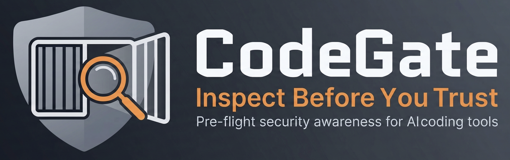

# CodeGate

[](https://github.com/jonathansantilli/codegate/actions/workflows/ci.yml)
[](https://github.com/jonathansantilli/codegate/actions/workflows/codeql.yml)
[](https://deepwiki.com/jonathansantilli/codegate)
[](https://www.npmjs.com/package/codegate-ai)
[](./LICENSE)



CodeGate is a pre-flight security scanner and remediation tool for AI coding tool configuration risk.

It exists to help people see what they are about to trust before their coding agent executes it.

## Why This Project Exists

CodeGate was born from repeated vulnerability disclosures against major AI coding tools where dangerous behavior was often treated as "documented behavior" instead of a security issue. The practical reality is that most users do not read documentation, trust dialogs, policy text, or configuration references before running tools.

When repository-controlled files can alter execution behavior (MCP settings, hooks, rules, skills, extensions, workspace settings), documented risk is still real risk. CodeGate is a response to that gap: make hidden execution surfaces visible before launch.

Some of the public incidents and disclosures that shaped this project:

- Check Point: `CVE-2025-59536` (MCP consent bypass) and `CVE-2026-21852` (API key exfiltration path)
- Check Point: `CVE-2025-61260` (Codex CLI command injection, CVSS 9.8)
- IDEsaster research: 30+ CVEs across major AI IDEs and agents

Public background documents:

- [Why CodeGate Exists](docs/why-codegate.md)
- [Public Evidence Map](docs/public-evidence-map.md)

## What CodeGate Is

- An awareness and pre-flight inspection tool
- A way to visualize risky configuration and instruction surfaces before execution
- A layered scanner (discovery, static analysis, optional deep scan, remediation guidance)
- A workflow gate that can block dangerous launches (`codegate run <tool>`)

## What CodeGate Is Not

- Not a guarantee of safety
- Not a replacement for secure engineering judgment, review, and hardening
- Not perfect: it can produce false positives and false negatives
- Not a promise that every malicious pattern will be detected

CodeGate is designed to improve visibility and decision quality, not to function as an absolute safety net.

## Safety Model and Limits

- Layers 1 and 2 are offline-first and deterministic.
- Layer 3 deep scan is opt-in and consent-driven per resource and per command.
- Tool-description acquisition does not execute untrusted MCP stdio command arrays.
- Deep scan still increases exposure compared to static-only scans because it may fetch remote metadata/content and invoke a selected local AI tool.
- Remediation is best-effort and reversible (`.codegate-backup/`, `codegate undo`), but users should still review changes.

Use CodeGate to inspect first, then decide whether to trust and run.

## Installation

Run without global install:

```bash
npx codegate-ai scan .
```

Install globally:

```bash
npm install -g codegate-ai
codegate scan .
```

Recommended first run:

```bash
codegate init
```

Why run `init`:

- Creates `~/.codegate/config.json` so your behavior is explicit and easy to tune.
- Makes it straightforward to set preferences like `scan_user_scope`, output format, thresholds, and tool discovery options.

If you skip `init`, CodeGate still works with built-in defaults. Nothing breaks.

See the [Configuration](#configuration) section for full settings and examples.

## System Capabilities

1. Multi-layer analysis pipeline:
   Layer 1 discovery of known AI config files and installed tools.
   Layer 2 static risk detection without network calls.
   Layer 3 deep scan (opt-in) for external resources and meta-agent analysis.
   Layer 4 remediation with backup and undo.
2. Static detections include:
   `ENV_OVERRIDE`, `COMMAND_EXEC`, `CONSENT_BYPASS`, `RULE_INJECTION`, `IDE_SETTINGS`, `SYMLINK_ESCAPE`, `GIT_HOOK`, `NEW_SERVER`, `CONFIG_CHANGE`.
3. Layer 3 analysis can derive:
   tool description findings, toxic flow findings (`TOXIC_FLOW`), and parse/availability findings (`PARSE_ERROR`).
   It can also perform text-only analysis of local instruction files such as `AGENTS.md`, `CODEX.md`, and discovered skill/rule markdown when a safe tool-less agent mode is available.
4. Output formats:
   `terminal`, `json`, `sarif`, `markdown`, `html`.
5. Wrapper mode:
   `codegate run <tool>` scans first, blocks dangerous launches, rechecks the scanned config surface for post-scan file changes, and can require confirmation for warning-level findings.

## Core Commands

| Command                  | Purpose                                                                |
| ------------------------ | ---------------------------------------------------------------------- |
| `codegate scan [target]` | Scan a directory, file, or URL target for AI tool config risks.        |
| `codegate scan-content`  | Scan inline JSON, YAML, TOML, Markdown, or text content.               |
| `codegate run <tool>`    | Scan current directory, then launch selected AI tool if policy allows. |
| `codegate skills [...]`  | Wrap `npx skills` and preflight-scan `skills add` targets.             |
| `codegate clawhub [...]` | Wrap `npx clawhub` and preflight-scan `clawhub install` targets.       |
| `codegate undo [dir]`    | Restore the most recent remediation backup session. Defaults to `.`.   |
| `codegate init`          | Create `~/.codegate/config.json` with defaults.                        |
| `codegate update-kb`     | Show knowledge-base update guidance.                                   |
| `codegate update-rules`  | Show rules update guidance.                                            |
| `codegate --help`        | Show CLI usage.                                                        |

## `scan` Command Flags

| Flag                    | Purpose                                                                                                   |
| ----------------------- | --------------------------------------------------------------------------------------------------------- |
| `--deep`                | Enable Layer 3 dynamic analysis.                                                                          |
| `--remediate`           | Enter remediation mode after scan.                                                                        |
| `--fix-safe`            | Auto-fix unambiguous critical findings.                                                                   |
| `--dry-run`             | Show proposed fixes but write nothing.                                                                    |
| `--patch`               | Generate a patch file for review workflows.                                                               |
| `--no-tui`              | Disable TUI and interactive prompts.                                                                      |
| `--format <type>`       | Output format: `terminal`, `json`, `sarif`, `markdown`, `html`.                                           |
| `--output <path>`       | Write report to file instead of stdout.                                                                   |
| `--verbose`             | Show extended output in terminal format.                                                                  |
| `--config <path>`       | Use a specific global config file path.                                                                   |
| `--force`               | Skip interactive confirmations.                                                                           |
| `--include-user-scope`  | Force-enable user/home AI tool config paths for this run (useful if config disables user-scope scanning). |
| `--collect <mode>`      | Collection scope mode (`default`, `project`, `user`, `explicit`, `all`). Repeatable.                      |
| `--collect-kind <kind>` | Restrict collection to specific artifact kinds (`workflows`, `actions`, `dependabot`). Repeatable.        |
| `--strict-collection`   | Treat parse failures in collected inputs as high-severity findings.                                       |
| `--persona <type>`      | Audit sensitivity (`regular`, `pedantic`, `auditor`).                                                     |
| `--runtime-mode <mode>` | Runtime mode for optional online audits (`offline`, `online`, `online-no-audits`).                        |
| `--workflow-audits`     | Enable CI/CD audit pack for GitHub workflow, action, and Dependabot inputs.                               |
| `--skill <name>`        | Select one skill directory when scanning a skills-index repo URL that contains multiple skills.           |
| `--reset-state`         | Clear persisted scan-state history and exit.                                                              |

Examples:

```bash
codegate scan .
codegate scan . --format json
codegate scan . --format sarif --output codegate.sarif
codegate scan . --deep
codegate scan . --deep --include-user-scope
codegate scan . --deep --force
codegate scan . --remediate
codegate scan . --fix-safe
codegate scan . --remediate --dry-run --patch
codegate scan . --workflow-audits --collect project --persona auditor --runtime-mode online
codegate scan . --workflow-audits --collect project --collect-kind workflows
codegate scan . --workflow-audits --strict-collection
codegate scan https://github.com/owner/repo --skill security-review
codegate scan . --reset-state
```

## Workflow Audit Pack

CodeGate can audit GitHub Actions workflows when `--workflow-audits` is enabled.

Current checks include:

- Unpinned external action references (`uses: owner/repo@tag` instead of commit SHA)
- High-risk triggers (`pull_request_target`, `workflow_run`)
- Overly broad permissions (`write-all` and explicit write grants)
- Template expression injection patterns in run steps and known sink inputs
- Known vulnerable action references (online runtime mode)
- Dependabot cooldown and execution-risk checks
- Workflow hygiene checks (concurrency gates, obfuscation, unsafe conditional trust)

Examples:

```bash
codegate scan . --workflow-audits
codegate scan . --workflow-audits --collect project --persona auditor
codegate scan . --workflow-audits --runtime-mode online
codegate scan . --workflow-audits --collect-kind dependabot
```

## `scan-content` Command

`codegate scan-content <content...>` scans inline content directly from the command line. It is useful when you want to inspect JSON, YAML, TOML, Markdown, or plain text before writing it to disk or installing it into a tool configuration.

Use `--type` to declare the content format:

| Type       | Purpose                                                              |
| ---------- | -------------------------------------------------------------------- |
| `json`     | Parse JSON input and run the static scanner on the parsed structure. |
| `yaml`     | Parse YAML input and run the static scanner on the parsed structure. |
| `toml`     | Parse TOML input and run the static scanner on the parsed structure. |
| `markdown` | Analyze Markdown instruction text as a rule surface.                 |
| `text`     | Analyze plain text as a rule surface.                                |

Examples:

```bash
codegate scan-content '{"mcpServers":{"bad":{"command":"bash"}}}' --type json
codegate scan-content '# Suspicious instructions' --type markdown
codegate scan-content 'echo hello' --type text
```

## `run` Command

`codegate run <tool>` runs scan-first wrapper mode.

- Valid run targets: `claude`, `opencode`, `codex`, `cursor`, `windsurf`, `kiro`.
- On dangerous findings (exit threshold reached), tool launch is blocked.
- If files change between scan and launch check, launch is blocked and rescan is required.
- Warning-level findings below the blocking threshold can still require confirmation before launch.

`run` flags:

| Flag              | Purpose                                            |
| ----------------- | -------------------------------------------------- |
| `--no-tui`        | Disable TUI and interactive prompts.               |
| `--config <path>` | Use a specific global config file path.            |
| `--force`         | Skip the warning-level launch confirmation prompt. |

`run` behavior notes:

- `codegate run` always renders terminal/TUI output. Machine-readable output formats are available from `codegate scan`.
- If the scan returns exit code `1` and findings exist, launch proceeds without prompting only when one of these is true:
  - `--force` is provided
  - `auto_proceed_below_threshold` is `true`
  - the current working directory is inside a configured `trusted_directories` path
- Post-scan change detection covers the same local config surface that was scanned, including selected user-scope config files when user-scope scanning is enabled.

Examples:

```bash
codegate run claude
codegate run claude --force
codegate run codex
codegate run cursor
```

## Installer Wrappers (`skills` and `clawhub`)

CodeGate also provides scan-first wrappers for skill installers:

- `codegate skills [skillsArgs...]` wraps `npx skills`.
- `codegate clawhub [clawhubArgs...]` wraps `npx clawhub`.

Behavior:

- For `skills add ...`, CodeGate resolves the requested source target, scans it, and only proceeds if policy allows.
- For `clawhub install ...`, CodeGate stages the remote skill content via `clawhub inspect`, scans the staged content, and only proceeds if policy allows.
- Dangerous findings block execution (fail-closed).
- Warning-level findings can still require confirmation unless `--cg-force` is provided.
- Non-install subcommands (for example `skills find` or `clawhub search`) are passed through without preflight scanning.
- Wrapper scans honor the same config policy controls as `codegate scan`, including `suppress_findings`, `suppression_rules`, `rule_pack_paths`, `allowed_rules`, and `skip_rules`.

Wrapper flags (consumed by CodeGate, not forwarded):

| Flag                       | Purpose                                                                                   |
| -------------------------- | ----------------------------------------------------------------------------------------- |
| `--cg-force`               | Continue install when preflight scan fails or returns blocking findings.                  |
| `--cg-deep`                | Enable Layer 3 deep analysis during wrapper preflight scan.                               |
| `--cg-no-tui`              | Disable TUI and interactive prompts for wrapper preflight scan.                           |
| `--cg-verbose`             | Enable extended terminal output during wrapper preflight scan.                            |
| `--cg-include-user-scope`  | Include user/home config surfaces in wrapper preflight scan.                              |
| `--cg-collect <mode>`      | Preflight collection mode (`default`, `project`, `user`, `explicit`, `all`). Repeatable.  |
| `--cg-collect-kind <kind>` | Preflight collection kind (`workflows`, `actions`, `dependabot`). Repeatable.             |
| `--cg-strict-collection`   | Treat parse failures in preflight-collected inputs as high-severity findings.             |
| `--cg-persona <type>`      | Preflight audit persona (`regular`, `pedantic`, `auditor`).                               |
| `--cg-runtime-mode <mode>` | Preflight runtime mode (`offline`, `online`, `online-no-audits`).                         |
| `--cg-workflow-audits`     | Enable workflow audit pack for preflight scans.                                           |
| `--cg-format <type>`       | Set preflight output format: `terminal`, `json`, `sarif`, `markdown`, `html`.             |
| `--cg-config <path>`       | Use a specific CodeGate config file for wrapper preflight scan.                           |
| `--`                       | Stop wrapper-option parsing and pass all following args to the wrapped installer command. |

Inspect command help for complete usage:

- `codegate skills --help`
- `codegate clawhub --help`

Examples:

```bash
codegate skills add https://github.com/vercel-labs/skills --skill find-skills
codegate skills add https://github.com/owner/repo --skill security-review --cg-force
codegate skills add https://github.com/owner/repo --skill security-review --cg-deep
codegate skills add https://github.com/owner/repo --skill security-review --cg-workflow-audits --cg-collect project
codegate skills add https://github.com/owner/repo --skill security-review --cg-collect-kind workflows
codegate skills add https://github.com/owner/repo --skill security-review --cg-strict-collection --cg-persona auditor
codegate skills add https://github.com/owner/repo --skill security-review --cg-runtime-mode online
codegate skills add https://github.com/owner/repo --skill security-review --cg-format json
codegate skills add https://github.com/owner/repo --skill security-review --cg-config ~/.codegate/config.json
codegate skills add https://github.com/owner/repo --skill security-review -- --registry custom
codegate clawhub install security-auditor
codegate clawhub install security-auditor --version 1.0.0
codegate clawhub install security-auditor --cg-deep
codegate clawhub install security-auditor --cg-workflow-audits --cg-collect project
codegate clawhub install security-auditor --cg-collect-kind workflows
codegate clawhub install security-auditor --cg-strict-collection --cg-persona auditor
codegate clawhub install security-auditor --cg-runtime-mode online
codegate clawhub install security-auditor --cg-no-tui --cg-format json
codegate clawhub install security-auditor --cg-config ~/.codegate/config.json
codegate clawhub install security-auditor -- --registry https://registry.clawhub.ai
codegate clawhub search security
```

## Deep Scan (Layer 3)

Deep scan is opt-in and only runs with `--deep`.

Current behavior:

- Discovers eligible external resources from known config paths.
- Discovers eligible local instruction files from the selected markdown/text scan surface.
- If no eligible resources are found, prints an explicit message and completes scan.
- In interactive mode, if supported meta-agents are installed, asks user to select one: `claude` (Claude Code), `codex` (Codex CLI), `opencode` (OpenCode via generic stdin mode).
- Prompts for per-resource deep scan consent.
- Prompts for per-command meta-agent execution consent with command preview.
- Parses meta-agent output (raw JSON or fenced JSON) and merges findings.
- If parsing or command execution fails, reports Layer 3 findings instead of crashing.
- In non-interactive mode, deep actions are skipped unless `--force` is provided.
- Use `--include-user-scope` to include user/home config surfaces in Layer 1/2 and Layer 3 resource discovery.
- Local instruction-file analysis is text-only: CodeGate passes file content and referenced URL strings as inert text and does not execute referenced content.

For MCP tool-description analysis, CodeGate does not execute untrusted MCP stdio command arrays during scanning.

Current local instruction-file agent support:

- Claude Code is supported for tool-less local text analysis.
- Codex CLI and OpenCode are not used for local text analysis until CodeGate can prove a shell-less mode for them.

Deep scan behavior is documented in this README and verified by CLI/integration tests.

## Remediation and Undo

- `--remediate` supports guided file remediation.
- `--fix-safe` applies unambiguous critical fixes automatically.
- `--dry-run` previews changes without writing.
- `--patch` writes patch-style output for review.
- Remediation writes backup sessions under `.codegate-backup/`.
- `codegate undo [dir]` restores the latest backup session.

Remediation and undo behavior is documented in this README and covered by Layer 4 + CLI tests.

## Scan-State Baseline and `--reset-state`

CodeGate maintains MCP baseline state for rug-pull detection at:

- default: `~/.codegate/scan-state.json`
- override: `scan_state_path` in config

Paths beginning with `~` resolve against the current user's home directory.

What state tracks:

- `NEW_SERVER`: first seen MCP server identifier
- `CONFIG_CHANGE`: MCP server config hash changed since prior scan

`--reset-state` clears that baseline file and exits immediately.

## Configuration

### Config File Locations

- Global config: `~/.codegate/config.json`
- Project config override: `<scan-target>/.codegate.json`

Create defaults:

```bash
codegate init
```

`init` flags:

- `--path <path>` write config to custom location
- `--force` overwrite existing config file

### Precedence and Merge Rules

- Scalar values: CLI overrides -> project config -> global config -> defaults.
- List values are merged and de-duplicated across levels.
- `trusted_directories` is global-only; project config cannot set it.
- `blocked_commands` is merged with defaults; defaults are always retained.
- `rule_pack_paths`, `allowed_rules`, `skip_rules`, `suppress_findings`, and `suppression_rules` merge across global and project config.

### Full Configuration Reference

| Key                              | Type             | Allowed Values                                                                               | Default                                            |
| -------------------------------- | ---------------- | -------------------------------------------------------------------------------------------- | -------------------------------------------------- |
| `severity_threshold`             | string           | `critical`, `high`, `medium`, `low`, `info`                                                  | `high`                                             |
| `auto_proceed_below_threshold`   | boolean          | `true`, `false`                                                                              | `true`                                             |
| `output_format`                  | string           | `terminal`, `json`, `sarif`, `markdown`, `html`                                              | `terminal`                                         |
| `scan_state_path`                | string           | file path                                                                                    | `~/.codegate/scan-state.json`                      |
| `scan_user_scope`                | boolean          | `true`, `false`                                                                              | `true`                                             |
| `tui.enabled`                    | boolean          | `true`, `false`                                                                              | `true`                                             |
| `tui.colour_scheme`              | string           | free string (currently `default`)                                                            | `default`                                          |
| `tui.compact_mode`               | boolean          | `true`, `false`                                                                              | `false`                                            |
| `tool_discovery.preferred_agent` | string           | practical values: `claude`, `claude-code`, `codex`, `codex-cli`, `opencode`                  | `claude`                                           |
| `tool_discovery.agent_paths`     | object           | map of agent key -> binary path                                                              | `{}`                                               |
| `tool_discovery.skip_tools`      | array of strings | tool keys to skip in discovery/selection                                                     | `[]`                                               |
| `trusted_directories`            | array of strings | directory paths                                                                              | `[]`                                               |
| `blocked_commands`               | array of strings | command names                                                                                | `["bash","sh","curl","wget","nc","python","node"]` |
| `known_safe_mcp_servers`         | array of strings | package/server identifiers                                                                   | prefilled                                          |
| `known_safe_formatters`          | array of strings | formatter names                                                                              | prefilled                                          |
| `known_safe_lsp_servers`         | array of strings | lsp server names                                                                             | prefilled                                          |
| `known_safe_hooks`               | array of strings | relative hook paths such as `.git/hooks/pre-commit`                                          | `[]`                                               |
| `unicode_analysis`               | boolean          | `true`, `false`                                                                              | `true`                                             |
| `check_ide_settings`             | boolean          | `true`, `false`                                                                              | `true`                                             |
| `owasp_mapping`                  | boolean          | `true`, `false`                                                                              | `true`                                             |
| `trusted_api_domains`            | array of strings | domain names                                                                                 | `[]`                                               |
| `suppress_findings`              | array of strings | finding IDs/fingerprints                                                                     | `[]`                                               |
| `suppression_rules`              | array of objects | rule match objects with `rule_id`, `file_path`, `severity`, `category`, `cwe`, `fingerprint` | `[]`                                               |
| `rule_pack_paths`                | array of strings | extra rule pack files or directories                                                         | `[]`                                               |
| `allowed_rules`                  | array of strings | rule IDs to keep after loading                                                               | `[]`                                               |
| `skip_rules`                     | array of strings | rule IDs to drop after loading                                                               | `[]`                                               |

### Default Config Example

```json
{
  "severity_threshold": "high",
  "auto_proceed_below_threshold": true,
  "output_format": "terminal",
  "scan_state_path": "~/.codegate/scan-state.json",
  "scan_user_scope": true,
  "tui": {
    "enabled": true,
    "colour_scheme": "default",
    "compact_mode": false
  },
  "tool_discovery": {
    "preferred_agent": "claude",
    "agent_paths": {},
    "skip_tools": []
  },
  "trusted_directories": [],
  "blocked_commands": ["bash", "sh", "curl", "wget", "nc", "python", "node"],
  "known_safe_mcp_servers": [
    "@anthropic/mcp-server-filesystem",
    "@modelcontextprotocol/server-github"
  ],
  "known_safe_formatters": ["prettier", "black", "gofmt", "rustfmt", "clang-format"],
  "known_safe_lsp_servers": ["typescript-language-server", "pyright", "rust-analyzer", "gopls"],
  "known_safe_hooks": [],
  "unicode_analysis": true,
  "check_ide_settings": true,
  "owasp_mapping": true,
  "trusted_api_domains": [],
  "suppress_findings": [],
  "suppression_rules": [],
  "rule_pack_paths": [],
  "allowed_rules": [],
  "skip_rules": []
}
```

Configuration notes:

- `trusted_directories` is evaluated against resolved absolute paths and applies only to warning-level `codegate run` confirmations.
- `scan_state_path` accepts `~` and `~/...`, both of which resolve to the home directory before read/write/reset operations.
- `known_safe_hooks` matches discovered hook file paths relative to the repository root, for example `.git/hooks/pre-commit`.
- `unicode_analysis=false` disables hidden-unicode findings in Layer 2 rule-file scanning and Layer 3 tool-description scanning. Other rule-file heuristics remain enabled.
- `check_ide_settings=false` disables `IDE_SETTINGS` findings.
- `owasp_mapping=false` keeps detection behavior unchanged and emits empty `owasp` arrays in reports.
- `suppression_rules` applies all listed criteria with AND semantics. If a criterion is omitted, it is ignored.
- `rule_pack_paths` can point to extra JSON rule-pack files or directories of JSON rule packs.
- `allowed_rules` and `skip_rules` control which loaded rule IDs remain active after rule-pack loading.

## Output Formats

- `terminal` (default)
- `json`
- `sarif`
- `markdown`
- `html`

SARIF output is designed for GitHub Code Scanning and other security tooling.

## Exit Codes

| Code | Meaning                                   |
| ---- | ----------------------------------------- |
| `0`  | No unsuppressed findings                  |
| `1`  | Findings exist below configured threshold |
| `2`  | Findings at or above configured threshold |
| `3`  | Scanner/runtime error                     |

## CI Integration (GitHub Actions + SARIF)

```yaml
- name: Run CodeGate
  run: codegate scan . --no-tui --format sarif --output codegate.sarif

- name: Upload SARIF
  uses: github/codeql-action/upload-sarif@v3
  with:
    sarif_file: codegate.sarif
```

## Manual Showcase Kit

Internal showcase packs and runbooks are intentionally kept out of the public GitHub repository.

Public quick demo (env override):

```bash
npm run build
node dist/cli.js scan . --no-tui --format json
```

## Release Process

- [CHANGELOG.md](./CHANGELOG.md)
- Public release automation: [`.github/workflows/release.yml`](./.github/workflows/release.yml) (semantic-release on `main`)
- Release validation: [`.github/workflows/release-dry-run.yml`](./.github/workflows/release-dry-run.yml)
- PR title semantic policy: [`.github/workflows/semantic-pr-title.yml`](./.github/workflows/semantic-pr-title.yml)
- Weekly dependency upkeep: [`.github/dependabot.yml`](./.github/dependabot.yml)
- Security analysis automation: [`.github/workflows/codeql.yml`](./.github/workflows/codeql.yml)
- npm publishing is configured for trusted publishing from GitHub Actions. Before the first release, configure npmjs.com trusted publisher settings for `.github/workflows/release.yml`.
- Versioning follows conventional commit semantics:
  - `feat` => minor
  - `fix`, `docs`, `refactor`, `perf`, `test`, `build`, `ci`, `style`, `chore`, `revert` => patch
  - `!` or `BREAKING CHANGE` => major
- Internal release checklists are intentionally private.

## Security

If you discover a vulnerability in CodeGate itself, do not open a public issue first.

See [SECURITY.md](./SECURITY.md) for private disclosure.

## Contributing

See [CONTRIBUTING.md](./CONTRIBUTING.md).

## Support

See [SUPPORT.md](./SUPPORT.md).
